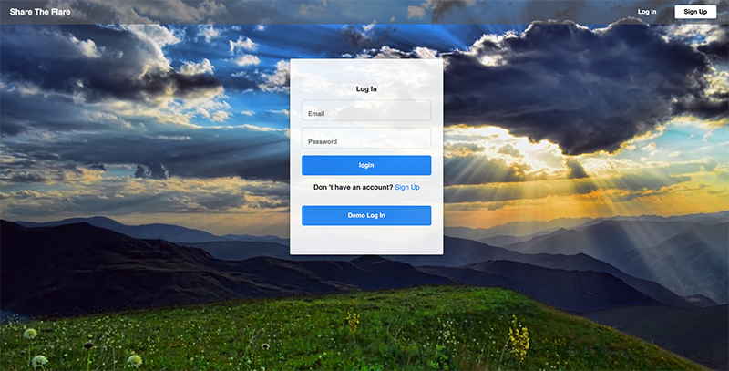
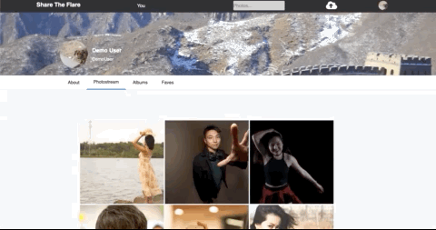
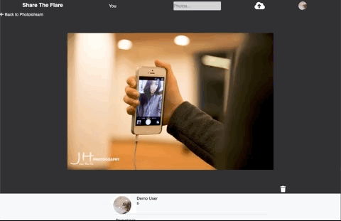
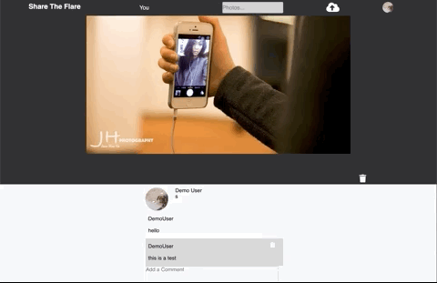
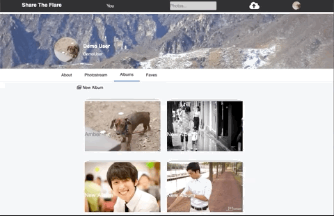
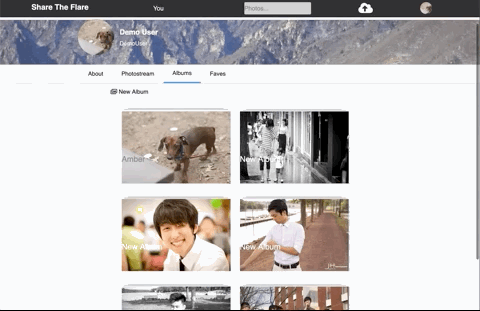
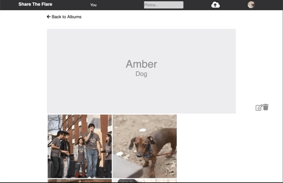

# README

[ShareTheFlare](https://share-the-flare.jeanwooha.me) is a clone of Flickr, a photo sharing site. It uses Ruby on Rails for the back-end, React-Redux on the front-end, and aws for the storage database.

- **Features**
  - Sign up, log in, and log out
  - Create, edit, and destroy Photos
  - Create, edit, and destroy Albums
  - Create and delete Comments
- Coming Soon
  - Tags
  - Favorites
  - Followers
  - Better UI experience
  - Slider for both the splash page and photo show pages  

# Technologies
#### Backend
 - Ruby on Rails
 - PostgreSQL
 - AWS S3
 - AJAX with JSON api

#### Frontend
 - React
 - Redux
 - BCrypt
 
# Features

## User Authentication

With Rails as the backend, a password digest is stored into the database when using BCrypt in order to have the content encrypted. When logging in, the email and password will be compared to data within the database.

## User Photos

When a user uploads a photo, it will show up on their profile page. When entering into the photo, the user can edit or even delete the photo through the association between Users and Photos.

## Comments

Within a photo, a user can create and delete comments.

## Creating an Album

When creating an album, joins associations are used to create an album with multiple photos by the same user.

## Albums

A user can view all the albums, add photos, and delete albums. 

